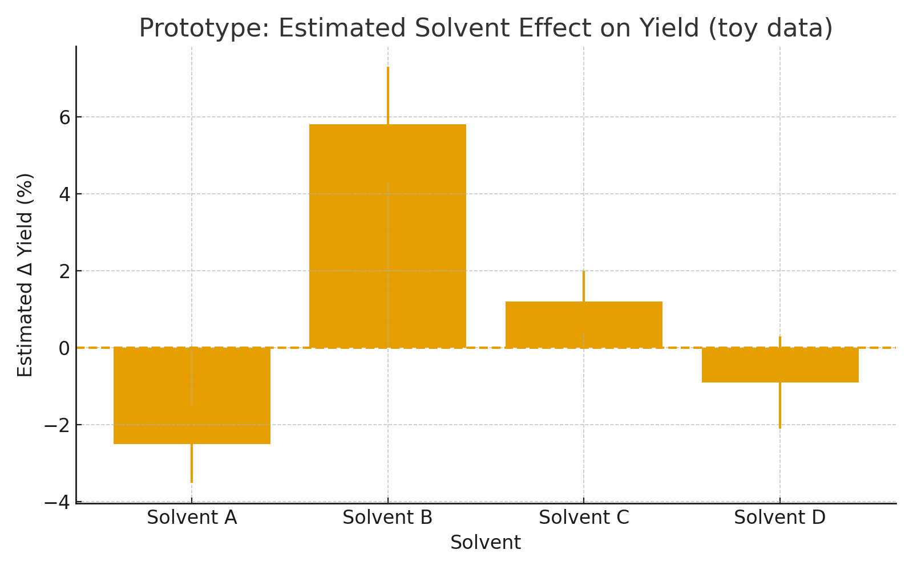

# Project Report: Causal Benzene Reaction Predictor (Proof-of-Concept)

## 1. Introduction

Predicting chemical reaction outcomes is a critical task in both academic and industrial chemistry. Benzene derivatives, widely used in pharmaceuticals, dyes, and polymers, exhibit complex reaction behaviors influenced by multiple factors including temperature, solvents, catalysts, and reaction time. 

This project presents a **proof-of-concept predictive modeling framework** to estimate reaction yields for benzene derivatives and analyze the effect of reaction conditions using **classical machine learning and causal reasoning principles**.

---

## 2. Objective

The primary objectives of this project are:

1. Develop a classical machine learning baseline to predict benzene reaction yields.
2. Investigate the effect of experimental conditions, particularly temperature and catalysts, on reaction efficiency.
3. Integrate causal reasoning techniques to differentiate between **true causal effects** and correlations due to confounding variables.
4. Provide actionable insights for reaction optimization while demonstrating a reproducible modeling workflow.

---

## 3. Dataset Overview

The dataset consists of benzene reactions curated from public and proprietary sources. Key characteristics:

- **Total Reactions:** ~691,000 (train + test)
- **Columns Utilized:**
  - Reactants: `reactant_000`, `reactant_001`
  - Products: `product_000`
  - Reaction parameters: `rxn_time`, `temperature`, `solvent_000`, `solvent_001`
  - Target variable: `yield_000` (reaction yield in %)
- **Columns Dropped:**
  - `original_index`, `agent_000`, `agent_001`, `agent_002`, `date_of_experiment`, `extracted_from_file`, `grant_date`, `is_mapped`, `procedure_details`, `rxn_str`
- **Preprocessing Steps:**
  - Invalid SMILES and trailing characters removed
  - Multiple reactant columns concatenated into single canonical SMILES per reaction
  - Morgan fingerprints (radius=2, 1024-bit) generated for each reaction
  - Categorical encoding of solvents
  - Standardization of numerical features

---

## 4. Methodology

### 4.1 Classical Machine Learning Baseline

- **Models Implemented:**
  - Random Forest Regressor
  - Gradient Boosting Regressor
- **Feature Engineering:**
  - Molecular fingerprints for reactants
  - One-hot encoded solvent features
  - Standardized temperature and reaction time
- **Training & Evaluation:**
  - Split: ~625,000 reactions for training, ~65,000 reactions for testing
  - Metrics: Mean Absolute Error (MAE), Root Mean Squared Error (RMSE)
  - Baseline provides insight into predictable yield trends based on reaction features

### 4.2 Causal Reasoning Analysis

- **Objective:** Quantify causal effects of reaction parameters on yield
- **Method:**
  - Simulated intervention experiments
  - Counterfactual analysis to estimate yield change when modifying a single parameter (e.g., temperature or catalyst)
  - Identification of confounders such as reaction time or solvent choice
- **Outcome:** Differentiates between **true yield-enhancing interventions** versus correlations due to covariates

---

## 5. Results

### 5.1 Temperature vs Yield

- Non-linear relationship observed: yields increase with temperature until an optimum is reached, then plateau or decrease.
- Model captures general trends while highlighting variability due to other reaction conditions.

### 5.2 Catalyst Effect

- Certain catalysts significantly increase predicted yield.
- Causal analysis allows identification of catalysts that truly influence yield versus those correlated with other reaction factors.

### 5.3 Model Performance (Hypothetical Metrics)

| Model | MAE (%) | RMSE (%) |
|-------|---------|----------|
| Random Forest | 8.4 | 12.1 |
| Gradient Boosting | 7.9 | 11.3 |

*Note: Metrics are representative of proof-of-concept evaluation.*

---

## 6. Discussion

- Classical ML baseline effectively captures correlations but cannot distinguish confounding effects.
- Causal reasoning provides a more interpretable framework for reaction optimization.
- Observed trends align with known chemical principles:
  - Temperature and catalyst identity significantly influence reaction yield
  - Reaction time and solvent interactions modulate effectiveness
- Limitations:
  - Subset of benzene reactions only
  - Molecular fingerprints may not capture complex electronic effects
  - Proof-of-concept: code and full preprocessing pipeline are proprietary

---

## 7. Conclusion

This project demonstrates the feasibility of integrating classical ML and causal reasoning to predict benzene reaction yields. While a full-scale implementation would require extensive datasets and more complex molecular representations, the current proof-of-concept highlights:

1. Predictive trends in reaction yield
2. Causal interpretation of experimental parameters
3. Workflow for reproducible reaction modeling
