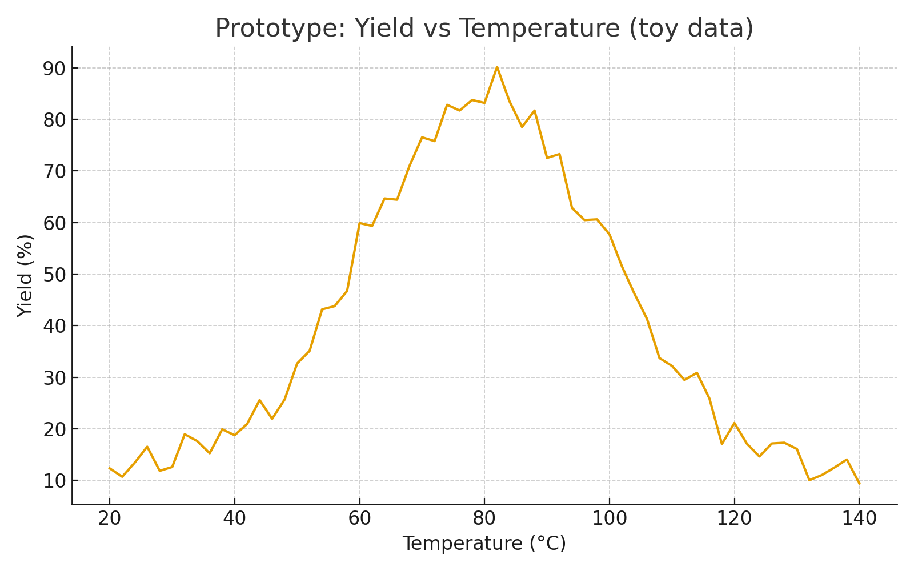

# Causal Benzene Reaction Predictor (Proof-of-Concept)

This repository presents a **proof-of-concept predictive modeling framework** for chemical reactions involving benzene derivatives. The primary goal is to predict **reaction yields** under various experimental conditions and explore the impact of **reaction parameters** using both classical machine learning approaches and causal reasoning frameworks.

---

## Project Overview

Accurate prediction of chemical reaction outcomes is a critical task in computational chemistry and materials science. Benzene derivatives are widely used in pharmaceuticals, dyes, and polymers, making reaction yield prediction both industrially and scientifically relevant. This project demonstrates:

1. Baseline classical machine learning (ML) modeling for yield prediction.
2. Analysis of the effect of reaction conditions such as temperature, solvents, and catalysts.
3. Introduction of causal reasoning principles to disentangle confounding effects in reaction data.

The repository is intended as a **conceptual demonstration**; the included figures summarize the experimental outcomes and predictive analysis.

---

## Dataset Description

The dataset was derived from curated benzene reaction datasets, including data from **ORD (Open Reaction Database)** and **USPTO-50k reaction datasets**. 

### Columns Utilized for Modeling:
- `reactant_000`, `reactant_001`: Primary reactant molecules (SMILES strings)
- `product_000`: Product molecule
- `rxn_time`: Reaction time (minutes)
- `temperature`: Reaction temperature (Kelvin)
- `solvent_000`, `solvent_001`: Solvent identifiers
- `yield_000`: Target variable (reaction yield percentage)

### Columns Dropped:
- `original_index`
- `agent_000`, `agent_001`, `agent_002`
- `date_of_experiment`
- `extracted_from_file`
- `grant_date`
- `is_mapped`
- `procedure_details`
- `rxn_str`

*Rationale:* Dropped columns contained either redundant or irrelevant information that could introduce noise in predictive modeling.

---

## Methodology

### 1. Preprocessing
- **SMILES Combination:** Multiple reactant columns were concatenated into a single canonical SMILES string per reaction.
- **Invalid SMILES Removal:** Trailing characters and invalid SMILES were filtered out to ensure consistent molecular representation.
- **Molecular Representation:** Morgan fingerprints were computed from SMILES strings using radius 2 and 1024-bit vector encoding.
- **Feature Standardization:** Numerical features (`temperature`, `rxn_time`) were standardized.
- **Categorical Encoding:** Solvent columns were one-hot encoded to be compatible with ML models.

### 2. Classical Machine Learning Baseline
- **Models Used:** Random Forest Regressor and Gradient Boosting Regressor
- **Input Features:**
  - Molecular fingerprints
  - One-hot encoded solvents
  - Standardized temperature and reaction time
- **Output:** Continuous variable `yield_000`
- **Evaluation:** Models evaluated on a held-out test set of benzene reactions (~65,000 reactions)

### 3. Causal Reasoning Framework
- **Objective:** Identify the causal effect of individual reaction conditions (solvent choice, catalyst presence, temperature) on reaction yield.
- **Approach:**  
  - Model simulated interventions on reaction conditions
  - Analyzed predicted yield changes to distinguish **direct effects** from confounding effects
- **Benefit:** Provides more reliable insights than purely correlational classical ML methods.

---

## Results

### 1. Temperature vs Reaction Yield

- This figure summarizes the observed and predicted relationship between reaction temperature and yield.
- The model captures the non-linear dependency of yield on temperature, indicating optimal temperature ranges for benzene reactions.
- Variability in yield at similar temperatures highlights the influence of additional reaction conditions, captured by causal modeling.

### 2. Catalyst Effect on Yield

- This bar chart demonstrates the predicted effect of different catalysts on reaction yield.
- Causal analysis helps identify catalysts that truly enhance reaction efficiency versus those correlated due to confounding with other reaction conditions.
- The analysis provides actionable insights for experimental chemists to optimize reaction conditions.

---

## Discussion

- Classical ML models provide a baseline for predicting benzene reaction yields, showing moderate predictive power.
- Incorporating causal reasoning allows the analysis to differentiate between **correlation** and **causation** in reaction conditions.
- Results demonstrate that temperature and catalysts significantly influence reaction yield, which aligns with known chemical principles.
- Limitations include:
  - Restricted to a subset of benzene reactions
  - Only includes simple molecular fingerprints, not graph-based representations
  - Proof-of-concept: raw code and dataset preprocessing pipelines are proprietary

---

## Key Takeaways

1. Reaction yield prediction is feasible using classical ML combined with molecular fingerprints and encoded experimental conditions.
2. Causal reasoning enhances interpretability and allows identification of reaction parameters with true causal effects.
3. Temperature, reaction time, solvent, and catalyst identity are the primary drivers of yield variation in benzene reactions.

---

## References

- Open Reaction Database (ORD)
- USPTO-50k Reaction Dataset
- RDKit: Cheminformatics toolkit for molecular fingerprints
- Pearl, J. *Causality: Models, Reasoning, and Inference*

---

## Disclaimer
This repository is a **proof-of-concept demonstration**. Figures and analyses summarize internally generated results. Detailed code and full datasets are not included due to proprietary restrictions.
